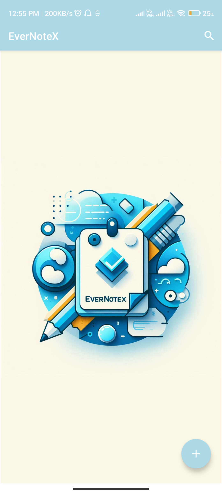
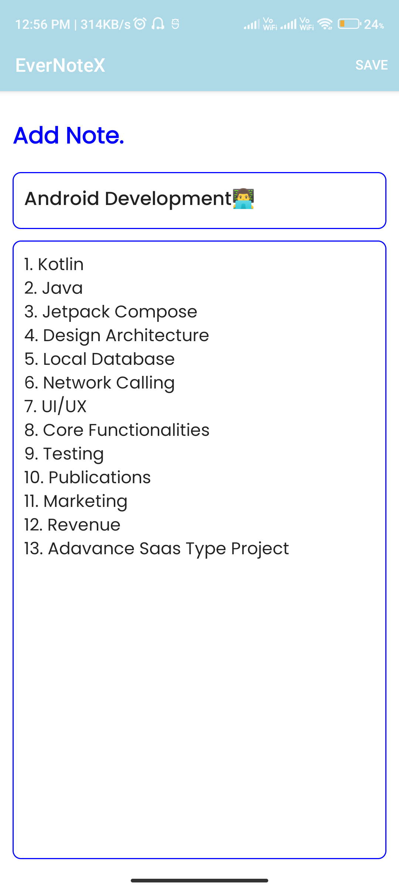
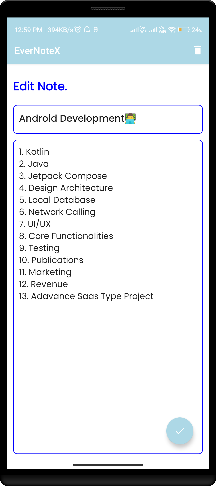
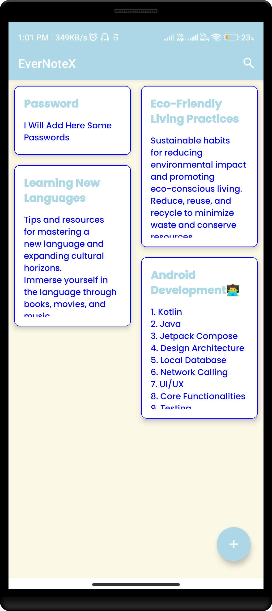

# EverNoteX

EverNoteX is a versatile note-taking app designed to help you organize your thoughts, ideas, and tasks effortlessly. With its intuitive interface and powerful features, EverNoteX empowers you to capture, manage, and access your notes anytime, anywhere.

<div style="display: flex; justify-content: center;">
    
    
    
    
</div>

<!-- ## Overview

EverNoteX offers a seamless note-taking experience with a range of features to suit your needs:

- Create and organize notes with customizable titles and descriptions.
- Add tags and categories to your notes for easy sorting and filtering.
- Attach images, files, and links to your notes for reference.
- Sync your notes across multiple devices for access on the go.
- Customize the app's appearance with themes and color schemes.
- Secure your notes with password protection and encryption. -->


## Installation

To install EverNoteX, follow these simple steps:

1. Clone the repository to your local machine:

   ```bash
   git clone https://github.com/sbmshukla/evernotex.git

2. Navigate to the project directory:
   
   ```bash
   cd evernotex

3. Install dependencies:

    ```bash
    npm install

4. Run the app:

   ```bash
   npm start

## Usage

Once EverNoteX is installed, you can start creating and managing your notes right away. Use the intuitive interface to add, edit, and organize your notes effortlessly. Explore the app's features to discover new ways to stay organized and productive.

## Contributing

We welcome contributions from the community to help improve EverNoteX. If you encounter any bugs, have feature requests, or want to contribute code, please submit a pull request or open an issue on GitHub.
<!--
## License

EverNoteX is licensed under the MIT License. Feel free to use, modify, and distribute the code for personal or commercial projects. -->

## Contact

For questions, feedback, or support related to EverNoteX, please contact us at sbmshukla17@gmail.com.
